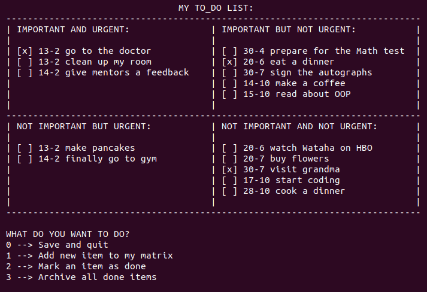
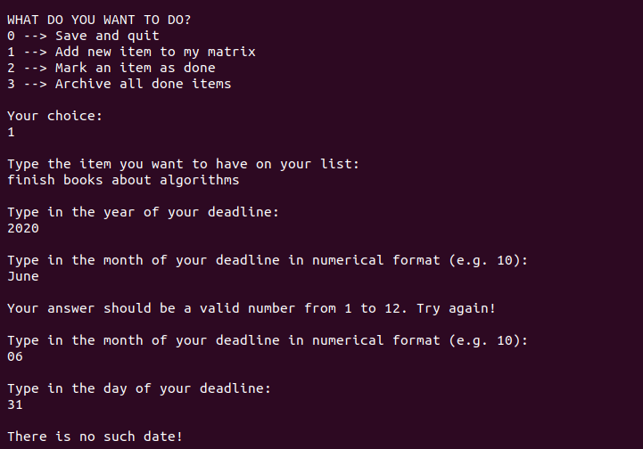
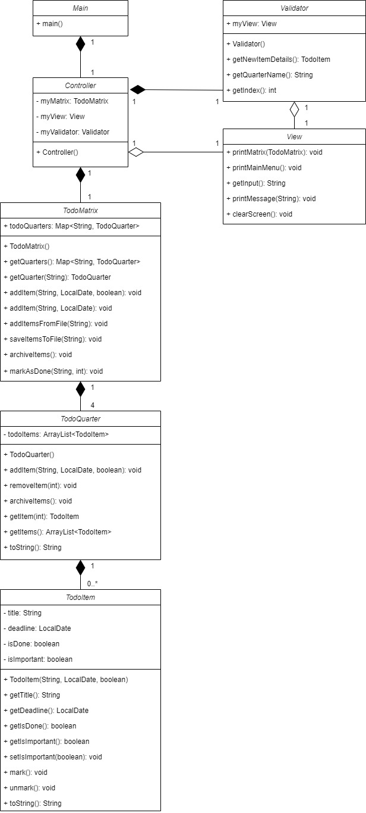

# Java exercise 1 - Eisenhower matrix
Project done at the beginning of learning Java, also as a part of intoduction to basic OOP concepts.
The main goal was to use classes properly in order to create the matrix to organize to-do list.

## General info
The Eisenhower Matrix is a great tool for time managing and improve your productivity. It is often used in IT projects teams to prioritize tasks.

The main features of the program are:
* Presenting the matrix to the user, with items sorted by deadline

* Reading items from file and saving them to file while closing program
* Adding new items to the matrix (with foolproof validation and exceptions handling). They are automatically added to proper quarter depending on the deadline and importance of the task.

* Marking items as done
* Archiving all done items

## First approach to UML diagrams
Preparing UML class diagrams were also part of Codecool workshops. Below is the first attempt to creating such diagram for this project:

## Technologies
* Java SE 13

## Lessons learned from the assignment
* Working with basic OOP structures and concepts
* Getting familiar with Java documentation, syntax, data structures etc.

## Status
Project is finished.

## Credits
Project assigned and supervised by Codecool mentors.

